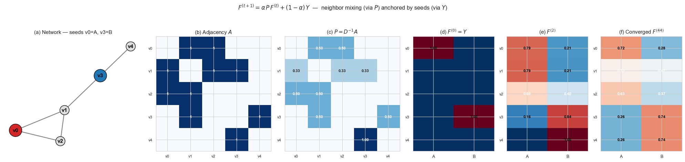
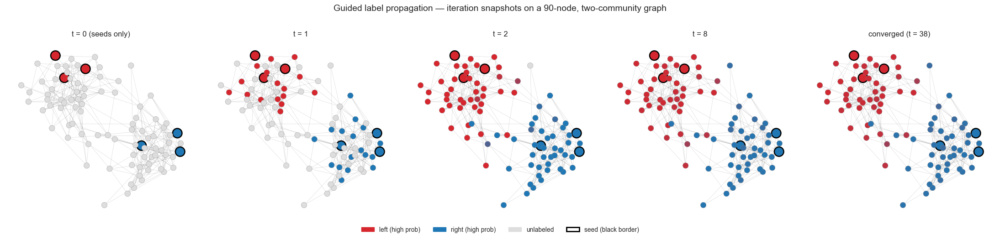
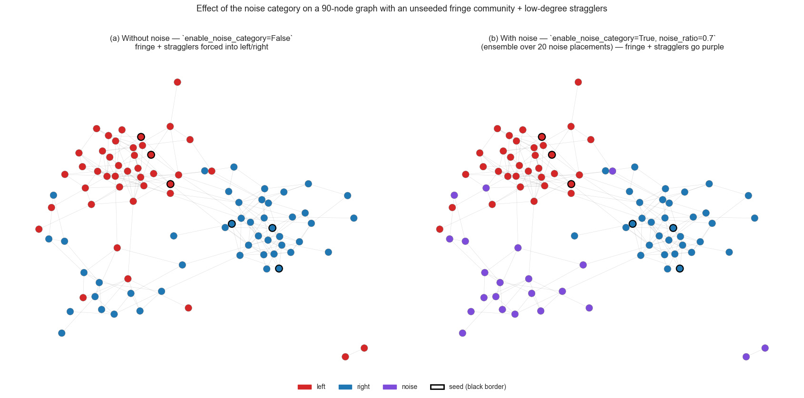
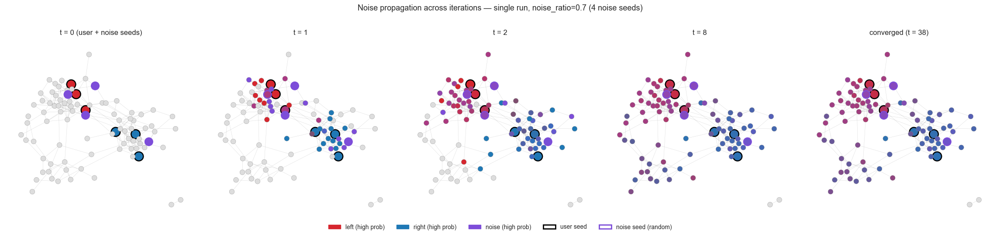
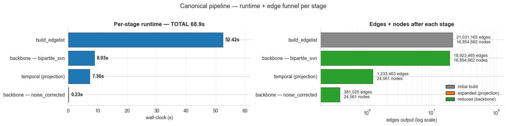
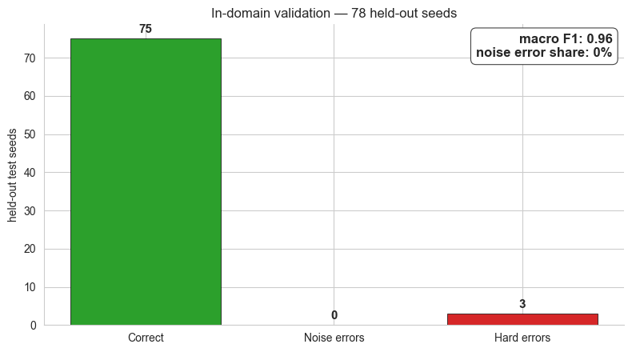
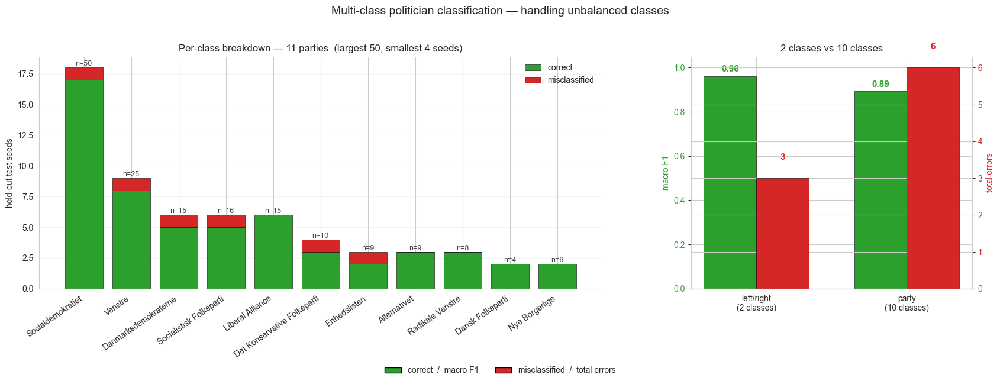
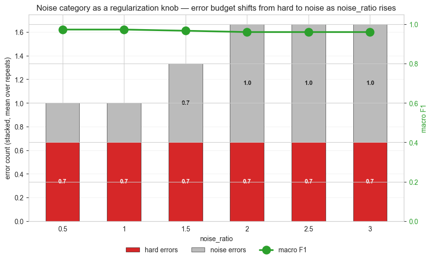
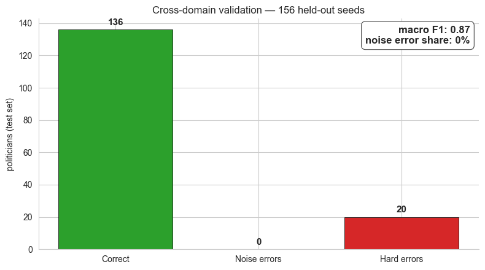
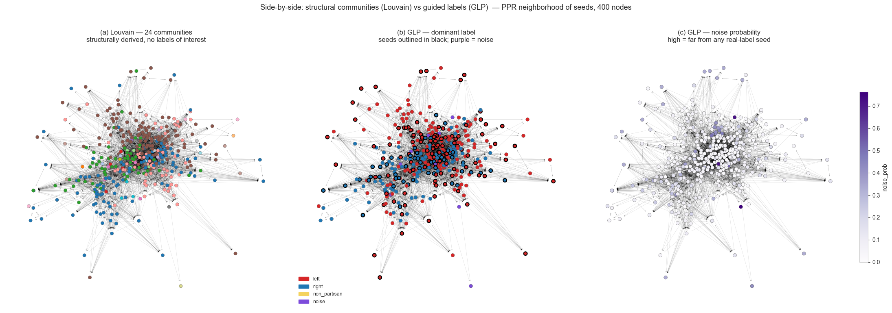

> 📓 **[View the full notebook (with code) →](Tool%20demo/glp_tool_demo_v2.ipynb)**
>
> This README shows the explanations and results only. Click through for the complete code, parameters, and step-by-step walkthrough.

---

# Guided Label Propagation — Tool Demo
*Semi-supervised community detection for large-scale information-sharing networks.*

**Motivation** — When you have a messy information sharing network with many nodes and only solid knowledge about a fraction of them.

**Unique features**
- ⚡ Fast (and memory efficient) on large data using Polars + NetworkIt + streamlined backboning
- 🎯 Intuitive regularization via noise category — interpretable regularization knob
- 📊 Full-attribute export — labels · probs · noise → Gephi GEXF
- 🔁 Mulitple network configurations: Directed + undirected - weighted + unweighted - bipartite + unipartite

## Sections
§2 Math · §3 Tool intuition · §4 Demonstration using real world data (+ validation) · §5 Cross-domain demonstration (+ validation) · §6 Viz + Gephi

## Input examples
**Dataframe**
`acccount` · `url` · [`counts`· `timestamp`]

**Other Dataframes**  
`acccount` · `domain`  
`acccount` · `keyword`  
`acccount` · `account` · `embedding similarity`  

## 2. Math & architecture

$$F^{(t+1)} = \alpha \, P \, F^{(t)} + (1-\alpha)\, Y \qquad P = D^{-1}A$$

- $Y$ — seed indicator · $P$ — row-normalized transition · $\alpha$ — neighbor weight (0.85)
- $(1{-}\alpha)Y$ anchor → seeds stay pinned throughout
- Convergence: $\max\Delta F < 10^{-6}$ — usually <30 iters

**Canonical pipeline** — raw → bipartite EdgeList → SVN backbone → temporal projection (directed) → noise-corrected backbone. Three memory modes (`fast` / `balanced` / `low`).

    

    

## 3. The algorithm at work
- **3a** — clean two-community (90 nodes) — propagation mechanic via iteration snapshots
- **3b** — three-community + stragglers — role of noise category, with vs without

    Toy graph: 90 nodes (45 per community), 311 edges, 6 seeds (3 per community)

    Converged after 38 iterations (captured 39 snapshots including t=0).

    

    

### 3b. Messier graph — noise category in action

**Setup** — 90 nodes · 2 seeded communities · 1 unseeded fringe · 15 low-degree stragglers

**Two runs**
- `enable_noise_category=False` → every node forced into left/right
- `enable_noise_category=True, noise_ratio=0.7`, ensemble n=20 → distant regions → noise

    Messy graph: 90 nodes, 212 edges
      Community A (left-seeded):     30 nodes
      Community B (right-seeded):    30 nodes
      Community C (fringe, no seeds): 15 nodes
      Stragglers (low-degree):       15 nodes

    

    

**Per-iteration snapshots — with noise.** User seeds red/blue, noise seeds purple. Single run shown for visibility; the side-by-side above used ensemble averaging over 20 placements.

    

    

## 4. Pipeline + train/test on Facebook data
1 year Danish FB accounts sharing same URLs as politicians, news media, authorities and civil society actors.

**Four stage pipeline** — `build_edgelist` · `apply_backbone(bipartite_svn)` · `temporal_bipartite_to_unipartite` · `apply_backbone(noise_corrected)`. Polars + NetworkIt + SciPy sparse throughout.

    Loaded 21,035,585 share events
    Unique pages: 28,225
    Unique URLs:  16,830,862

<small>shape: (5, 4)</small><table border="1" class="dataframe"><thead><tr><th>o</th><th>e</th><th>dt</th><th>w</th></tr><tr><td>str</td><td>str</td><td>datetime[μs]</td><td>i64</td></tr></thead><tbody><tr><td>&quot;zzz.bedrenaetter.dk/outlet](zz…</td><td>&quot;193551540805898_Facebook Group&quot;</td><td>2022-12-01 09:36:14</td><td>1</td></tr><tr><td>&quot;zzwave.com/plaboard/posts/3968…</td><td>&quot;504143656428853_Facebook Group&quot;</td><td>2022-02-25 01:54:16</td><td>1</td></tr><tr><td>&quot;zzwave.com/plaboard/posts/3968…</td><td>&quot;VolusiaCountyRepublicanParty_F…</td><td>2022-02-24 19:23:13</td><td>1</td></tr><tr><td>&quot;zzs-blg.blogspot.com/2022/09/c…</td><td>&quot;121827024509492_Facebook Group&quot;</td><td>2022-10-16 21:21:48</td><td>1</td></tr><tr><td>&quot;zzoomm.teamtailor.com/jobs/209…</td><td>&quot;152966601945731_Facebook Group&quot;</td><td>2022-10-17 14:36:28</td><td>1</td></tr></tbody></table>

    

    

### 4a. Held-out train/test — left/right
- 20% stratified holdout · `directional_pass="out"` · `noise_ratio=0.3`

**Error split**
- `noise_errors` — model said *"I'm not sure"* → recoverable
- `hard_errors` — model picked the wrong real label confidently → real failure

    [ensemble_label_propagation] 2.01s | nodes=24,561 edges=381,025 | seeds=78 labels=2 alpha=0.85 epochs=30 | output=directional (tuple)

    

    

### 4b. Multi-class — party affiliation (10 classes)
- Same setup, label = party name
- **Heavily unbalanced** — largest 40+ members, smallest 4
- $(1{-}\alpha)Y$ anchor keeps each seed at 1.0 → no per-class re-weighting needed

    [ensemble_label_propagation] 6.54s | nodes=24,561 edges=381,025 | seeds=92 labels=11 alpha=0.85 epochs=30 | output=directional (tuple)

    

    

### 4c. The `noise_ratio` knob — swept
- `noise_ratio` ∈ {0, 0.1, 0.3, 0.5, 1.0} · `n_repeats=3`
- ↑ `noise_ratio` → noise absorbs uncertain mass · `noise_errors` ↑ · `hard_errors` ↓
- Optimum = `macro_f1` peak

    

    

## 5. Cross-domain: partisan news → politicians
**Seeds** content side (URLs) · **Test set** page side (politicians) — disjoint by construction.

### Stat-user augmentation
- Each labelled URL $c$ → synthetic anchor `__stat__c` connected to pages that shared $c$
- Anchors live in the **page partition** of the projection → GLP on clean page space
- $(1{-}\alpha)Y$ keeps anchors fixed throughout

`run_canonical_pipeline(content_seeds=stat_edges, protected_nodes=stat_ids)` attaches anchors before the projection backbone.

    [ensemble_label_propagation] 2.03s | nodes=24,585 edges=381,439 | seeds=12 labels=2 alpha=0.95 epochs=40 | output=directional (tuple)

    

    

## 6. Visualization + Gephi export
- Louvain consensus (×5, undirected) — unsupervised baseline
- PPR top-400 neighborhood of seeds — plottable subgraph
- Three matplotlib panels — Louvain · GLP dominant · GLP noise
- GEXF — typed attributes, opens directly in Gephi

    [guided_label_propagation] 0.40s | nodes=24,585 edges=381,439 | seeds=12 labels=2 alpha=0.85 | output=directional (tuple)
    GLP on 24,561 nodes — out-pass dominant_label counts:

<small>shape: (3, 2)</small><table border="1" class="dataframe"><thead><tr><th>dominant_label</th><th>count</th></tr><tr><td>str</td><td>u32</td></tr></thead><tbody><tr><td>&quot;noise&quot;</td><td>5407</td></tr><tr><td>&quot;left&quot;</td><td>15205</td></tr><tr><td>&quot;right&quot;</td><td>3973</td></tr></tbody></table>

    
    Louvain consensus: 78 communities across 24,561 nodes

    Reduced subgraph: 400 nodes, 5285 edges
    Layout ready.

    

    

### 6a. Gephi-ready export
`export_reduced_graph(method="influence", target_nodes=2000)` — real page nodes, no aggregation.
All attrs typed (`double` / `boolean` / `string`) → sliders + filters work directly in Gephi.

    
    Wrote output/dk_fb_reduced.gexf
    Reduced graph: 2000 nodes, 30452 edges
    
    First 5 nodes (preview of what's in the GEXF):

<small>shape: (5, 7)</small><table border="1" class="dataframe"><thead><tr><th>node_id</th><th>left_prob</th><th>right_prob</th><th>noise_prob</th><th>dominant_label</th><th>confidence</th><th>is_seed</th></tr><tr><td>str</td><td>f64</td><td>f64</td><td>f64</td><td>str</td><td>f64</td><td>bool</td></tr></thead><tbody><tr><td>&quot;100044360022428_Facebook Page&quot;</td><td>0.353378</td><td>0.547202</td><td>0.09942</td><td>&quot;right&quot;</td><td>0.547202</td><td>false</td></tr><tr><td>&quot;100063532930637_Facebook Page&quot;</td><td>0.370914</td><td>0.06771</td><td>0.561376</td><td>&quot;noise&quot;</td><td>0.561376</td><td>false</td></tr><tr><td>&quot;100063590635452_Facebook Page&quot;</td><td>0.176417</td><td>0.677026</td><td>0.146558</td><td>&quot;right&quot;</td><td>0.677026</td><td>false</td></tr><tr><td>&quot;100063643303178_Facebook Page&quot;</td><td>0.961074</td><td>0.032546</td><td>0.00638</td><td>&quot;left&quot;</td><td>0.961074</td><td>false</td></tr><tr><td>&quot;100063653915974_Facebook Page&quot;</td><td>0.615654</td><td>0.251797</td><td>0.132549</td><td>&quot;left&quot;</td><td>0.615654</td><td>false</td></tr></tbody></table>

## 7. Limitations 

- Tuning is needed to gurantee best results, many hyperparameters (still no free lunch)  
  
- If you have very large data, you still need a large machine

**See also** - 

---

## Guided Label Propagation

**Jakob Bæk Kristensen**
RUC Digital Media Lab

