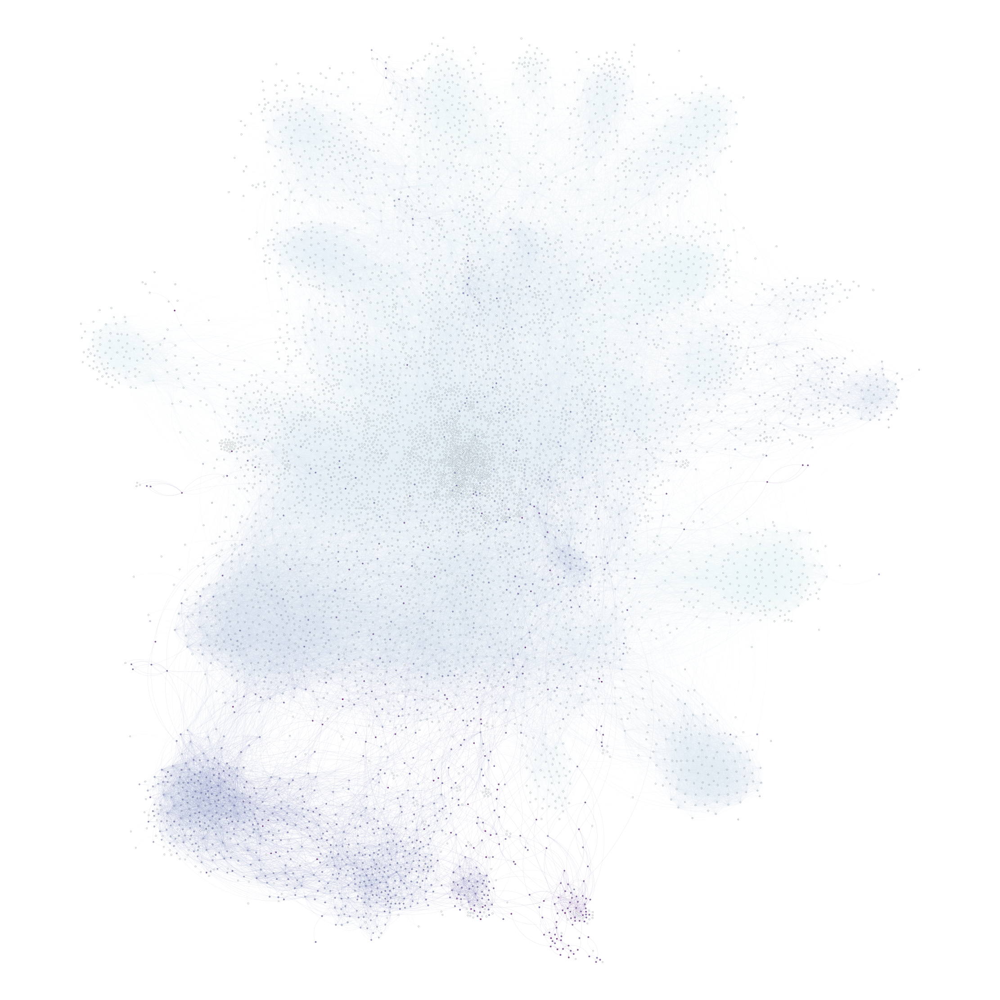

# Tool Demo: Guided Label Propagation for Semi-supervised Detection of Affinities in Large-scale Information Sharing Networks

## Introduction

This tool demo proposes a network analytical method, which has been named **guided label propagation**, and its implementation as an available Python package. The tool can be considered a method for semi-supervised community detection in large-scale networks. It has been developed in the context of information sharing where actors on digital platforms are considered connected if they have shared the same messages (e.g. retweeting, re-sharing) or the same entities such as URLs, images, memes (Gruzd et al., 2022) or similar distinguishable content features (Bruns et al., 2024).

The motivation behind the development of the tool is based on the current wide-spread use of network analysis and community detection. Network analysis is being used to find influential information spreaders (Bruns et al., 2021), their location in the information sharing landscape (Angus et al., 2023) and how well they cluster together with similar actors (Horne et al., 2019). In this endeavor community detection algorithms are often employed to map complex landscapes by identifying clusters of accounts with similar sharing behavior such as those often retweeting each other (Zhang et al., 2023), liking the same posts (Schmidt et al., 2017) or sharing the same links (Eady et al., 2020). Sometimes clusters are easily identified, such as in Glazunova et al., (2023), which maps the sharing of URLs to various Russian state-backed news sites on Facebook. However, at other times political information sharing patterns are not always simple to disentangle using standard community detection algorithms (e.g. Giglietto et al., 2022).

For complex networks containing tens of thousands of unknown accounts it can become difficult to ascertain what role they play in the network. **Guided label propagation** is a method to search for patterns pertaining specifically to categories of interest for the given study. The method has been used in practice to uncover actors engaging in the spread of misinformation and foreign interference propaganda [AUTHORS, 2024] in very large information sharing environment and in studies of political polarization [AUTHORS, 2023]. Rather than labelling nodes based on their belonging to clusters of a network partition, where the separation between clusters is determined by network structure (e.g. Blondel et al., 2008), **guided label propagation** instead relies on a small sample of *input nodes* with known affinities such as accounts belonging to political right- and left-wing actors. The labels of these known accounts (left and right wing) are then propagated throughout the network in order to uncover how strongly the rest of the accounts are affiliated with the position represented by those known accounts. The advantage of the approach lies in its ability to help researchers to identify the role of particular clusters in social media based information sharing networks by focusing on accounts' affinity towards known categories of interest rather than clusters that are initially arbitrary.

## Previous work on semi-supervised community detection

This tool contributes by further developing a semi-supervised community detection technique to be used specifically for analyzing information sharing on social media. Compared to the vast amount of research on community detection methods in general there is a dearth of exploration of semi-supervised techniques. Most studies only use semi-supervised techniques to optimize the same labeling strategies used in most community detection methods (e.g. Liu et al., 2014). In contrast, Truong et al., (2024) proposes an approach where web domains are pre-labeled as credible or not credible sources and then used as input nodes for a bipartite network consisting of Twitter users and domains, they have linked to whereafter the labels from the web domains are propagated to the users in order to reveal those with a high affinity for sharing low credibility sources. A similar approach has also been explored by Rao et al., (2021) for political attitudes. Both works demonstrate the usefulness of the approach but without testing its wider applicability.

The method proposed in this paper can theoretically be used for all types of information sharing behavior (retweeting, co-sharing hashtags, liking same content), however it is tested using networks based on social media accounts and their mutual sharing of URLs. The purpose of guided label propagation is finding patterns in networks containing sharing of diverse types of content, which is the case with URLs that can link to news, entertainment, videos, commercial appearances, personal blogs etc. (González-Bailón et al., 2022; Bruns, 2023).

## Exemplifying the tool: Detecting political affinities in networks based on mutual URL-sharing

The network constructed in this example builds on the assumption that if an account shares the same URL as another with a known political affiliation, then they are more likely to have the same political standpoint. Although, simply sharing a single URL to a right-wing outlet does not make an account a right-wing actor. The assumption is that over time, using enough data, accounts that slant more towards the right wing will share more of the same sources compared to left wing or other political entities, which is suggested by empirical research (e.g. Green et al., 2023).

The following example contains a network which is sampled from X (Twitter) and Facebook accounts that have at least once shared a URL from an account belonging to an alternative news outlet in Denmark (list found in Mayerhöffer, (2021)). However, the network also includes all non-alternative news URLs shared by the accounts as well as accounts that have then shared those non-alternative news URLs. Essentially it represents a network of 2 degrees of separation from Danish alternative news URLs.

We want to use the known political agenda of the alternative news outlets to explore political sharing patterns. Because some accounts have shared only a few URLs linking to alternative news outlets and hundreds of links to other types of content we can utilize **guided label propagation** to infer political affinities by relying on multiple degrees of associations. For example, starting from those accounts that often link to left-wing alternative news outlets we assume that a good portion of additional URLs they share are also motivated by their left-wing stance. By iteratively exploring such associations left-wing, right-wing and non-partisan alternative news labels can be propagated throughout the entire network.

### Figure 1: Node labelling based on Louvain and Guided Label Propagation

{width=45%}
{width=45%}

*In the guided label propagation illustration nodes are colored accordingly: red = left-wing, blue = right-wing, yellow = non-partisan, purple = noise.*

Figure 1 shows the labeling of nodes comparing a standard community detection technique (Louvain) with guided label propagation based on the three input labels right-wing, left-wing and non-partisan which were given to alternative news accounts with known political affiliation. The Louvain method detects a total of 21 clusters, which attests to the fact that there are factors other than the binary left-wing vs. right-wing classifications shaping URL sharing behavior. However, guided label propagation, in this case, helps to quickly give us an overview of the likely political orientation of accounts in the information sharing landscape which can help guide further investigation. Furthermore, guided label propagation also exports the normalized affinity scores based on the input labels, which can provide an even more precise overview of political orientation. Figure 2 shows node colors based on left-wing affinity (1 = very left-wing, 0 = not very left-wing), which can also help us identify nodes that have a balanced affinity towards both left and right-wing. For robustness guided label propagation also propagates a selection of randomly selected nodes to avoid overfitting for accounts that are very far away from any of the input nodes. Figure 3 shows "noisy areas" (purple) meaning the algorithm is less certain about the political affinity of those accounts.

### Figure 2: Guided Label Propagation normalized left-wing scores

{width=45%}

*In the illustration red nodes are those with high left-wing scores, blue nodes with very low scores and light greenish ones those with balanced scores.*

### Figure 3: Guided Label Propagation normalized noise scores

{width=45%}

The network contains 13,995 accounts total and uses only 27 accounts (those belonging to alternative news media with known political affiliation) to propagate left and right-wing labels to the rest. The results of the guided label propagation for the example are validated using a sample of 100 accounts belonging to politicians whose political affiliation is known. Despite most politicians not linking to alternative news sites, the **guided label propagation** is able to correctly label them by taking multiple degrees of association into account. In conclusion, the tool represents a viable approach for network analysis of complex information sharing behavior in cases where a more focused way of determining the role of clusters, compared to the completely unsupervised approach of traditional community detection algorithms, is needed.

## Demonstrating the tool

Presenting the tool will include a live demonstration of importing the package into a jupyter notebook and running analyses. Starting from a raw csv edgelist based on the same data used in the example described in the previous section, the demonstration will show how the data is converted into a bi-partite network and then projected as a uni-partite network containing millions of edges between the accounts, carrying out backboning and finally the label propagation. All in less than a minute to exhibit the computational efficiency of the tool for working with very large-scale data. Finally, we take a quick look at the results of the guided label propagation, which can be exported both as a graph and as a table containing the nodes and their affinity scores pertaining to each category represented by the input nodes.

## Tool Specifications

The **guidedLP** package provides a computationally efficient implementation of semi-supervised community detection for large-scale information sharing networks. The tool is designed for social science researchers studying political polarization, misinformation spread, and information sharing patterns on social media platforms.

### Core Algorithm

The guided label propagation algorithm extends traditional random walk-based label propagation by incorporating seed nodes with known category labels. The algorithm computes affinity scores through iterative propagation:

$$\mathbf{A}^{(t+1)} = (1-\alpha) \cdot \mathbf{P} \cdot \mathbf{A}^{(t)} + \alpha \cdot \mathbf{Y}$$

where $\mathbf{A}^{(t)}$ represents affinity scores at iteration $t$, $\mathbf{P}$ is the normalized transition matrix derived from the network adjacency matrix, $\mathbf{Y}$ contains initial labels for seed nodes, and $\alpha$ is the restart probability that balances network structure with seed node influence.

For directed networks, the algorithm computes separate affinity scores based on in-degree and out-degree propagation, allowing researchers to distinguish between content consumption patterns (in-degree) and sharing behavior (out-degree).

### Network Construction and Preprocessing

**Bipartite and Unipartite Networks**: The package supports construction from both bipartite networks (e.g., users × URLs) and direct unipartite networks (e.g., users × users). For bipartite networks, the package provides efficient weighted projection:

$$w_{ij} = \sum_{k \in \mathcal{N}(i) \cap \mathcal{N}(k)} \frac{w_{ik} \cdot w_{jk}}{|\mathcal{N}(k)|}$$

where $w_{ij}$ is the projected edge weight between nodes $i$ and $j$, and $\mathcal{N}(k)$ represents the neighborhood of intermediate node $k$.

**Network Backboning**: To reduce noise in dense networks, the package implements disparity filter (Serrano et al., 2009), which preserves statistically significant edges based on:

$$\alpha_{ij} = (1 - \frac{w_{ij}}{s_i})^{k_i - 1}$$

where $s_i$ is the strength (total weight) of node $i$ and $k_i$ is its degree. Edges with $\alpha_{ij} < \alpha_0$ are retained as significant.

### Regularization and Robustness

**Distance-based Regularization**: A distance penalty parameter $\lambda$ (default = 1) prevents label propagation from extending too far from seed nodes:

$$\mathbf{A}_{\text{reg}} = \mathbf{A} \cdot e^{-\lambda \mathbf{D}}$$

where $\mathbf{D}$ represents shortest path distances from seed nodes.

**Noise Sensitivity**: The algorithm includes a noise label that propagates from randomly selected nodes. The number of noise nodes is specified as a proportion of seed nodes (default = 0.1), helping identify regions of the network with uncertain category affiliation and preventing overfitting in peripheral areas.

### Implementation Details

**Computational Efficiency**: Built on NetworkIt (C++ graph library with Python bindings) and Polars (multi-threaded DataFrame operations), ensuring scalability to networks with billions of edges. The implementation leverages sparse matrix operations and parallel processing across all pipeline stages.

**Input Requirements**:
- Edge list format (CSV or Polars DataFrame) with source, target, and optional weight columns
- Seed node labels as dictionary mapping node identifiers to category labels
- Supports multiple simultaneous categories (multinomial classification)

**Output Format**:
- Node-level affinity scores for each category (normalized to sum to 1)
- Discrete label assignments based on maximum affinity
- Noise scores indicating classification uncertainty
- Export formats: Polars DataFrame, NetworkIt graph object, or CSV

**Graph Type Support**:
- Weighted and unweighted networks
- Directed and undirected networks
- Bipartite networks with projection

### Availability

The package is available on: https://github.com/alterPublics/guidedLP

## References

AUTHORS, 2024

AUTHORS, 2023

Angus, D., Bruns, A., Hurcombe, E., Harrington, S., & Tan, X. Y. (2023). Computational communication methods for examining problematic news-sharing practices on Facebook at scale. *Social Media+ Society*, *9*(3), 20563051231196880.

Blondel, V. D., Guillaume, J. L., Lambiotte, R., & Lefebvre, E. (2008). Fast unfolding of communities in large networks. *Journal of statistical mechanics: theory and experiment*, *2008*(10), P10008.

Bruns, A., Harrington, S., & Hurcombe, E. (2021). Coronavirus conspiracy theories: Tracing misinformation trajectories from the fringes to the mainstream. *Communicating COVID-19: interdisciplinary perspectives*, 229-249.

Bruns, A. (2023). From "the" public sphere to a network of publics: towards an empirically founded model of contemporary public communication spaces. *Communication Theory*

Eady, G., Bonneau, R., Tucker, J. A., & Nagler, J. (2020). News sharing on social media: Mapping the ideology of news media content, citizen

Giglietto, F., Olaniran, S., Mincigrucci, R., Marino, G., Mottola, S., & Terenzi, M. (2022). Blowing on the Fire: An Analysis of Low Quality and Hyper Partisan News Sources Circulated by Coordinated Link Sharing Networks in Nigeria. *Available at SSRN 4162030*.

Glazunova, S., Bruns, A., Hurcombe, E., Montaña-Niño, S. X., Coulibaly, S., & Obeid, A. K. (2023). Soft power, sharp power? Exploring RT's dual role in Russia's diplomatic toolkit. *Information, Communication & Society*, *26*(16), 3292-3317.

González-Bailón, S., d'Andrea, V., Freelon, D., & De Domenico, M. (2022). The advantage of the right in social media news sharing. *PNAS nexus*, *1*(3), pgac137.

Green, J., McCabe, S., Shugars, S., Chwe, H., Horgan, L., Cao, S., & Lazer, D. (2023). Curation bubbles. *OSF Preprints*. URL: https://osf.io/vbwer.

Gruzd, A., Mai, P., & Soares, F. B. (2022). How coordinated link sharing behavior and partisans' narrative framing fan the spread of COVID-19 misinformation and conspiracy theories. *Social Network Analysis and Mining*, *12*(1), 118.

Horne, B. D., Nørregaard, J., & Adalı, S. (2019, July). Different spirals of sameness: A study of content sharing in mainstream and alternative media. In *Proceedings of the International AAAI Conference on Web and Social Media* (Vol. 13, pp. 257-266).

Liu, D., Bai, H. Y., Li, H. J., & Wang, W. J. (2014). Semi-supervised community detection using label propagation. *International Journal of Modern Physics B*, *28*(29), 1450208.

Mayerhöffer, E. (2021). How do Danish right-wing alternative media position themselves against the mainstream? Advancing the study of alternative media structure and content. *Journalism Studies*, *22*(2), 119-136.

Rao, A., Morstatter, F., Hu, M., Chen, E., Burghardt, K., Ferrara, E., & Lerman, K. (2021). Political partisanship and antiscience attitudes in online discussions about COVID-19: Twitter content analysis. *Journal of medical Internet research*, *23*(6), e26692.

Schmidt, A. L., Zollo, F., Del Vicario, M., Bessi, A., Scala, A., Caldarelli, G., ... & Quattrociocchi, W. (2017). Anatomy of news consumption on Facebook. *Proceedings of the National Academy of Sciences*, *114*(12), 3035-3039.

Serrano, M. Á., Boguñá, M., & Vespignani, A. (2009). Extracting the multiscale backbone of complex weighted networks. *Proceedings of the National Academy of Sciences*, *106*(16), 6483-6488.

Truong, B. T., Allen, O. M., & Menczer, F. (2024). Account credibility inference based on news-sharing networks. *EPJ Data Science*, *13*(1), 10.

Zhang, Y., Chen, F., & Lukito, J. (2023). Network amplification of politicized information and misinformation about COVID-19 by conservative media and partisan influencers on Twitter. *Political Communication*, *40*(1), 24-47.
